## Resources
* Scheduling [click here](https://www.geeksforgeeks.org/cpu-scheduling-in-operating-systems/)
* GFG [click here](https://www.geeksforgeeks.org/operating-systems/)
# Operation System
## Characteristics 
* Memory Management
* Process Management
* Device Management
* File Management
* Provide Security

### Notes
* Every General Purpose COmputer have 
  * Hardware - CPU,ALU,I/O DEvice
  * OS 
  * System Application - Compiler , loader , editor  
  * Application
  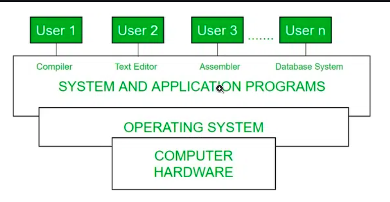

# Started to learn Neso Academy
## Computer System Architecture
* Types
  * Single Processor System - contains only one processor
  * Multiprocessor System - contains more than one processor
  * Cluster Processor System - contains 2 or more system coupled or clustered together
### Single Processor System
* It contains one general purpose processor 
* It contains one main CPU capable of executing a general purpose instruction set including instruction from the user processes
* Other special purpose processor are also present which perform device specific task (special  - eg : we have keyboard , when the button press then there is one microprocessor inside the keyboard that convert it to binary code and tell to computer)
### Multiprocessor System
* As the name suggests it have more than 2 porcessor which is also known as parallel system or tightly coupled systems
* Each processor are in communication sharing the computer but and  clock , memory etc
* Advantage 
  * Increased Throughput - more performance
  * Economy of scale - more prcessor have same resources - To multiprocessor using single processor (we need 3 single proccessor (larger in size))
  * More reliability - If one fails then the other can work 
#### Types of Multiprocessing System
* Symmetric Multiprocessing
* Asymmetric Multiprocessing
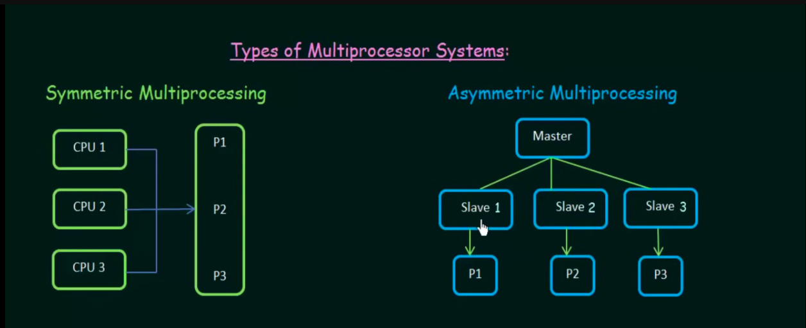
### cluster System
* It combines multiple CPU to perform a task . He two are more complete system is coupled together
* It provides high availability
* this can be structures assymetricly or symmetricly
## Operating System Structure
* Different OS vary from the internal making but all these have some comman things in them
  * Multitasking (Time sharing)
  * Multiprogramming
### Multiprogramming
* A single user cannot keep the CPU and I/O devices busy for all the times
* The capability of runningg a multiple program by the CPU
* The idea of the Multiprogramming is to utilize the CPU , but assigning different task to the CPU
* First all the task is stored in Main Memory , when one task get with I/O then the other task is aassigned to the CPU.
* It uses Job scheduling algorithm
* In multiprogramming user can't interact with the job
* Multiprogramming allows the system to handle multiple tasks by rapidly switching between them, ensuring that the CPU is kept busy.
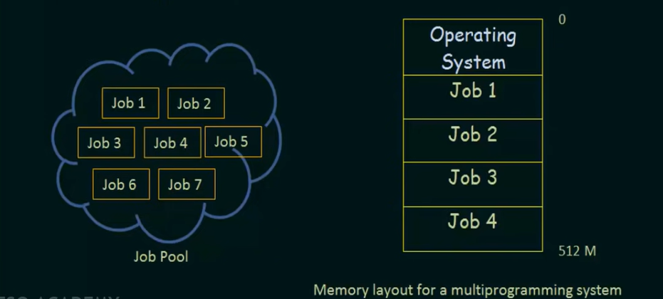
### MultiTasking
* In multitasking user can interact with the job
* CPU execute multiple job just by switching among them and user feels that all that happend simultaneously
* It is a part of Multiprogramming but with Round Robin System that gives you a fair usage share  
* Multiprogramming need only context switching but MultiTasking need both context switching and Time sharing too
* It uses Time sharing Algorithm
* Multitasking enables tasks to run concurrently, with the system managing multiple processes at the same time, utilizing multiple CPUs or time-sharing between tasks.
## Operating system Services

1. User Interface
    * CLI - Command Line Interface (here we give text based commands to perform some task by operating system)
    * GUI - Graphical Unser Interface (here we have pictorized view and using mouse we do operation and give input through keyboard)
1. Program Execution
    * Source Code -> Compiler -> Object Code -> Executor -> Output
1. I/O Operations
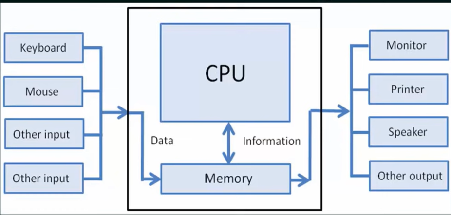
1. File System Manipulation
    * Permissing , searching , creating , deleting , renaming the file 
1. Communications
    * Different  processor in the same computer or different computer(throught network) are communicate each other with the help of OS
1. Error Detection
    * It need to handle all the ahrdware and software error occurs
1. Resource(SPU, files,I/o device , Main memory etc) Management
    * Allocating different resources to the different user and process inorder to make them efficient like all resource is availabe to all the process with less time 
1. Accounting
    * Need to keep trach that how much and what resources are hold by one user 
    * Basically it have the statistical way of the resource usage by each user
1. Protection and Security
    * It make sure that each processor cannot interfere with each other
    * It ensure all the system and resource are controlled
    * Make sure the resource are not used by the member who have no access in it
## User Interface Operating System
### Command Interpreter
* Some OS include Command interpreter in the kernel(heart of OS) itself
* Other Os like Windows XP and UNIX treat command interpreter as program itself
* System have multiple command interpreter is called **shell**
* Types of Shell are
  * Bourne Shell
  * C shell
  * Bourne Again Shell (BASH)
  * Korn shell
* How command interpreter works (2 ways)
  1. It have the program itself , once we enter the command it will run the program respective to the command
  1. Program is in somewhere , so when the command is written , our command interpreter just call the program 
### GUI 
* It gives graphical view of the data which is user friendly
## System calls
* There are 2 modes of that the program can execute
  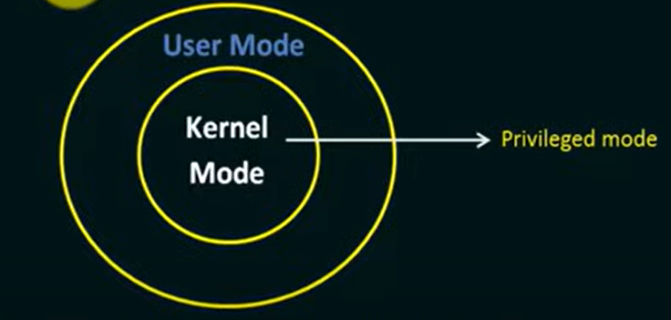
  * Kernel Mode : 
    * These program have direct access to the memory , hardware and resources
    * If any of the program crashed , the the system will be at **halt mode**
    * It is a priviledged mode of operation

  * User Mode :
    * These program doesn't have direct access to the memory , hardware and resources
    * If any program crashed then it wont crash the entire system and made into halt
    * It is a safer mode of operation
    * So many of the program executed in the User mode , but some of the code needs to access the resources , so it makes the call to the operating system like it need some access , so for that particular instance the program is switched from user mode to kernel mode . The process of converting user mode to kernel mode is called **mode switching**
    * The call we are doing is called **System call**
* System call is the one which computer program request a service from the kernel 
* These calls are generally available as routines in C/C++
* There are 1000 of system call occure to do a single task
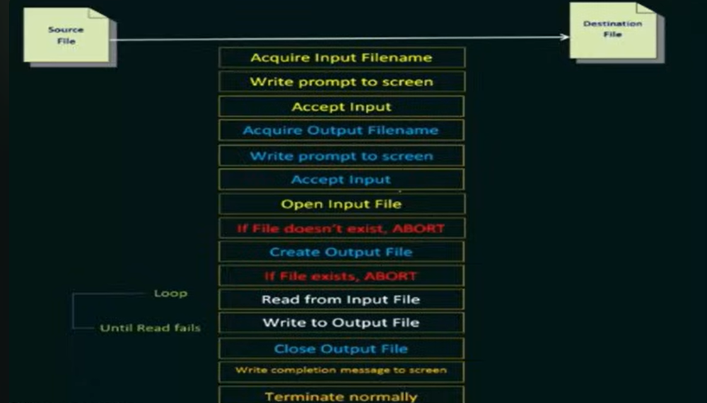
## Types of System calls
1. Process control
1. File Manipulation
1. Device management
1. Information Maintanence
1. Communications
### Process Control
* end,abort
* load,execute
* Create and terminate process
* get and set process attributes
* wait for time 
* wait event , signal event
* allocate and free memory
### File Manipulation
* create and delete file
* open , close 
* read , write , reposition
* get and set file attributes
### Device Manipulation
* request and release device
* read , write , reposition
* get and set device attributes
* logically attaching and detaching device (like eject a pendrive even though it is physically connected)
### Information Maintanence
* get and set time or date
* get and set system data
* get and set process , file or device attribute
### Communications
We know that the process communicate with each other , for that purpose we use this system calls
* create and delete communication connection
* send , receive messages
* transfer status information
* attach / detach the remote devices
## System Programs
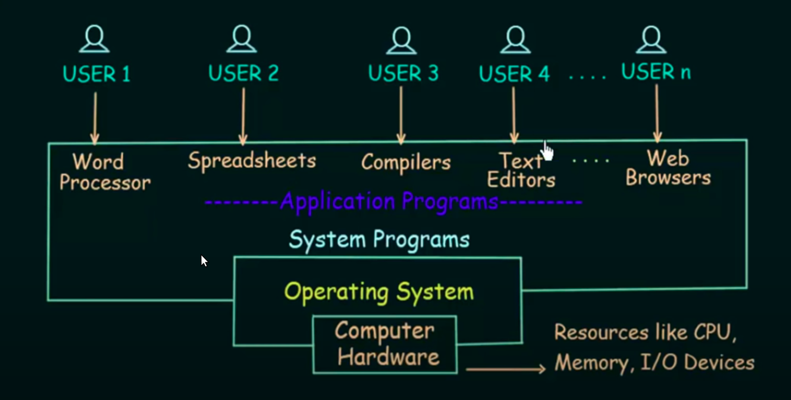
* It will provide an environment which is convenient for program , execution and development
* Some of them are simple user interface to system calls and some of them are more complex to understand
### Categories
1. File Management - Helps to manipulate the file (creste , delete , rename)
1. Status Information - Provides the current state of the system (logs, time , data,performance metrics,user and network status)
1. File Modification - changing the inner content of the file
1. Programming Language Support - provide (compiler, Assembler , Debugger and Interpreter) for some basic programming language (C,c++,python, perl)
1. Program loading and execution - When the program is ready after Assembling and compilation, it must be loaded into memory for execution. A loader is part of an operating system that is responsible for loading programs and libraries. It is one of the essential stages for starting a program. Loaders, relocatable loaders, linkage editors, and Overlay loaders are provided by the system.
1. Communications : Connections among processes, users, and computer systems are provided by programs. Users can send messages to another user on their screen, User can send e-mail, browsing on web pages, remote login, the transformation of files from one user to another.

## Operating System design and Implementation
* We need to define goads and specication
* Requirements
    * user
    * system
* Mechanism - how to to something
* Policy - what will be done
* Make sure both of them in a seperate manner
* Implementation
    * Once the OS is designed , it will be implemented
    * OS write in both assembly and High level language(C,c++)
    * Writing OS is high level language is better
        * It is easier to understand and debug
        * It is compact
    * If we write in Assembly , it works for the specific type of the CPU family like MS-DOS wrote in Intel 8088 Assembly Language , and it is available only to the intel family but linux is available to all kind of devices

## Structure of Operating System
1. Simple Structure : 
    * Here the all the layer have the access to the hardware components
    * It may leads to crash entire system  
    * It is not well protected , not well structured  and not well defined
    * eg: MS-DOS
    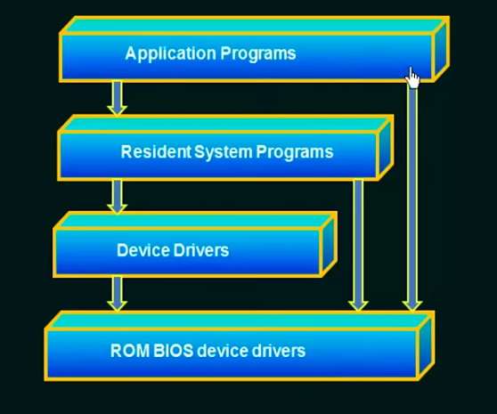
1. Monolithic Structure : 
    * Here the every function is placed at kernel in the form of pack 
    * So if we want to modify something , you need to touch the entire block 
    * So this make the system difficult to maintain and implement
    * eg: UNIX
    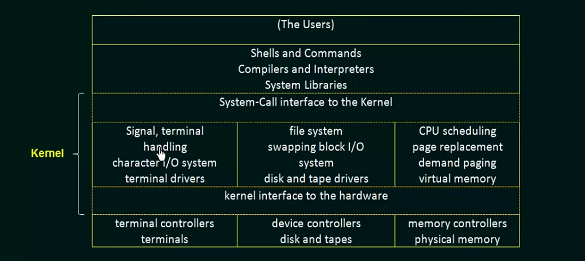
1. Layered Structure
    * Here the OS is divided into several layers
    * It is easier to implement and debug like if we have error in scheduling , then we modify only that particular layer and implement it
    * Here the disadvantage is we need to be careful in designing and deciding 
    * Like for memory management we need backing storage , so we need to makke sure that the backing storage layer is below the memory management layer 
    * This may not  be efficient , like if we need to use layer 0(innermost layer) , we need to request from all the other layer , like the top layer need to get the input from user which have that function in layer 0 , the top layer need to make system call for each and every layer and it will take some time
    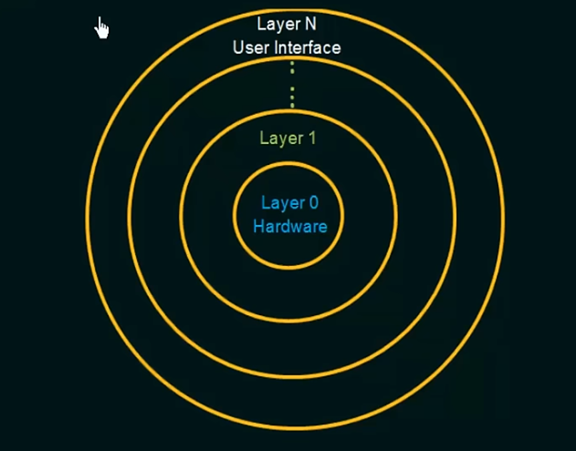
1. Microkernels
    * Here all the unessential components in the kernel and implement that in the sytem , user level programs
    * Here the Microkernel proveide the core functionalities of the kernel and the microkernel work is to provide a communication between client program and services
    * This communication process is known as message passing
    * Advantage
        * Here the most of the operation is done in user so there will be less possible to get the whole system crashed
    * Due to system function overhead the performance will be reduced
    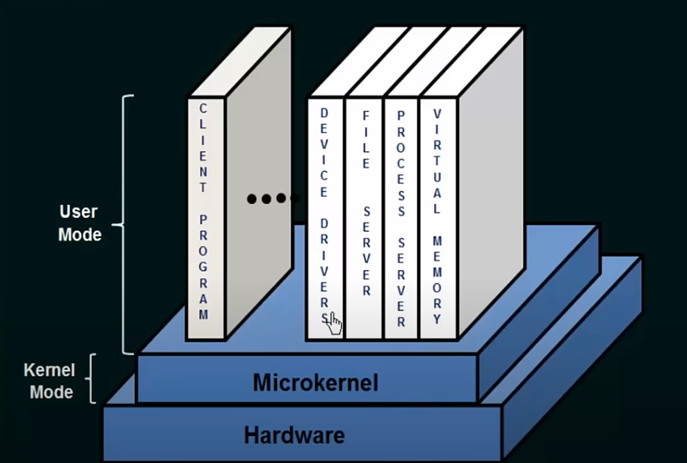
1. Modules
    * It is a modular approach in structuring of the Operating System
    * Here each layer have the protected interfaces
    * Here each of the module will communicate the other layer efficiently through core kernel (not like in layered structure)
    * Here the module are dynamically loaded into kernel so we dont need a message passing
    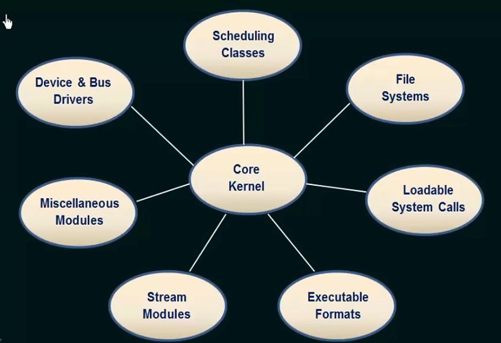
## Virtual Machines
* Here we take the single computer hardare and given into several different execution computer and we  give the illusion that they are runnign on their own private computer
* virtual - It is not physically present , but we try to make it look like this
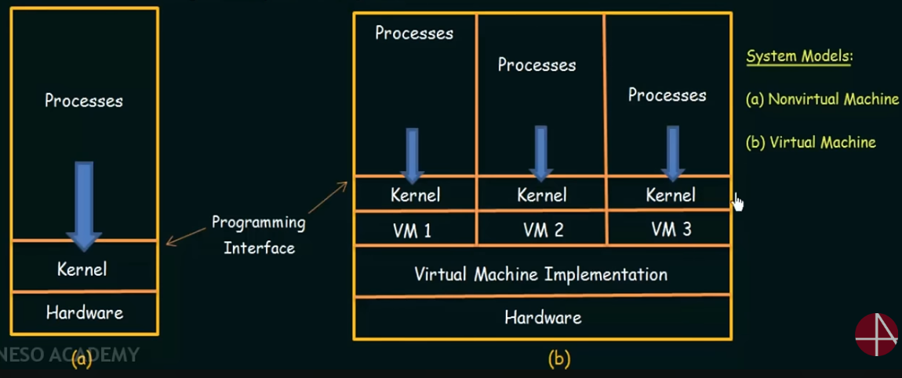
### Implementation
* Here The Virtual Machine software runs in Kernel mode
* But the virtual machine (VM1,VM2) itself run in user mode
* Each Virtual Machine are isolated from each other
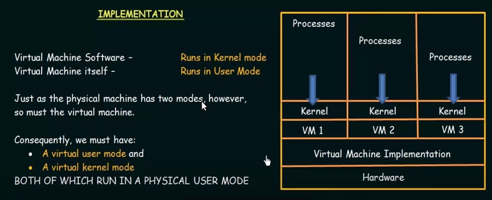
* Virtual machine is an idea where multiple  systems share a common hardware and each system assumes that it's an individual complete system. The basic operating system is in kernal mode while those of virtual machine are in user mode. However, each single system has two modes in turn i.e, virtuall user mode and virtual kernel mode.
## OS Generation and System Boot
* To design an operating system , there are 2 ways
1. Design code and implement an os specifically for one machine at a time
1. OS are designed to run on any of a class of machines at a variety of sites with the variety of peripheral configurations (Linux)  
* The second approach is the most commonly used method and we have a doubt different system have different hardware configurations , how we can achieve this 
    * The system must be configured or generated for each specific computer site , a process known as system generation (SYSGEN) is used .
* The following information is determined by the SYSGEN
    * What CPU is used ?
    * How much memory is available
    * What devices are available
    * What operating system options are desired
### System Boot
* The process of starting the system by loading the kernel is known as booting the system
* With the help of bootstrap program or bootstrap loader,the kernel is finded and loaded
* This program is stored in the the form of ROM  , because ROM is non-volatile memory and it cannot affected by the virus
* Firmware : It is also a Read Only Memory 
* In small system , both of the OS and bootstrap program are stored in the ROM , so here the OS is in ROM , it cannot be modified , so to get another OS , we need to change the chip , we also have another way like EPROM(Erasable Programmable Read Only Memory).
* But in sytem , The bootstrap program is in ROM and OS is in Disk .
* When the full bootstrap program is loaded , it can travers the entire file system to find the system kernel ,load into memory and start the execution . At this point only we can say our system is **running**.
## Process Management
* When the program is inn execution , we can say it as process
* Thread is a unit of execution within a process , a proces can have one or more than one thread
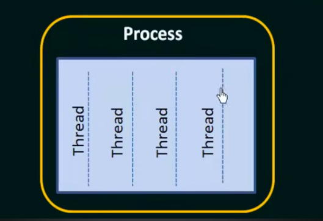
## Process State
* When the process is exucutes , it will change its state
* The state is determined by the current activity of the process
* Each process have the following states    
    * NEW - NEw process is created
    * WAIT - The process is waiting for some process to occur
    * RUNNING - Instruction are being executes
    * READY - The process is waiting to be assigned cd to a processor
    * TERMINATED - The process has finished its execution
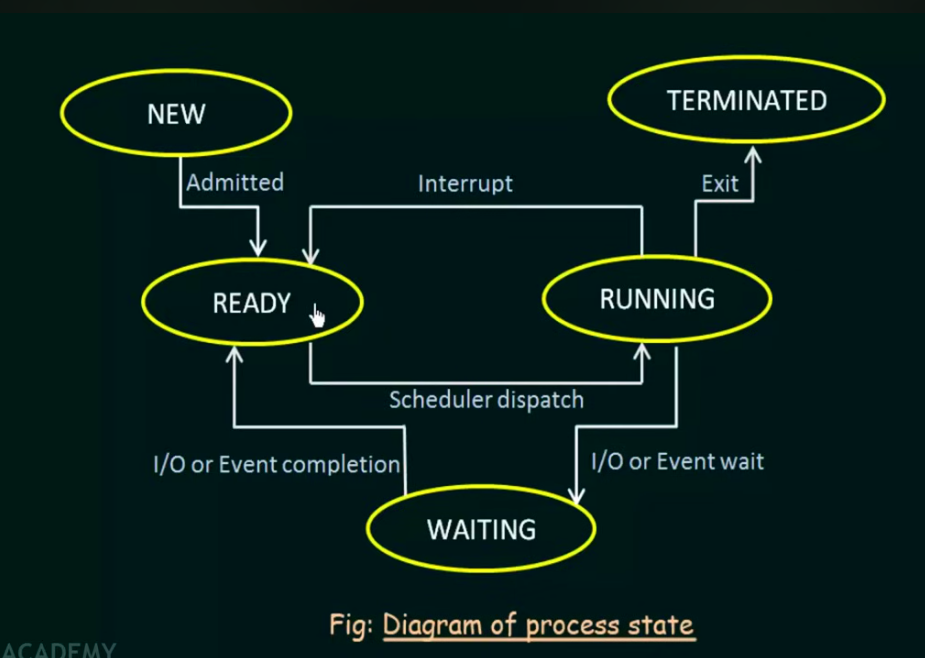
## Process control block
* It is also called Task control block
* Each process is represented in the OS by Process Control block
* Registers : they are registers used for particular purpose
* Accounting information : Keeps an accout of certain things like the resources ae used by the certain things
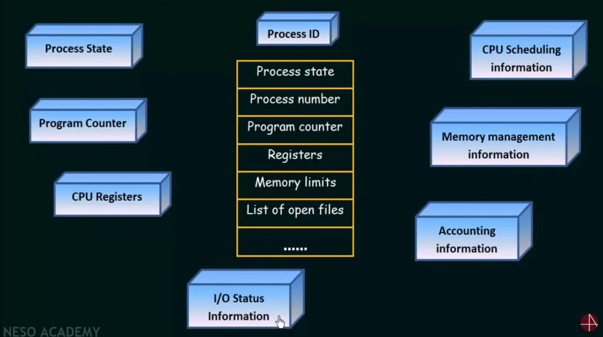
```
A process control block is a block located inside the OS.

This block has many parts to control the process:
- PID or process number: unique id of the process
- process state
- program counter: the address of the next line of instruction of the execution
- CPU registers: which register being used by the process
- CPU scheduling info: order of execution of processes
- memory management
- account management: info of resources used by the process (memory, CPU, time, I/O devices)
- I/O status info
```
 


# Need to learn 
* Memory Fragmentation

# Topics to learn
# Operating System Study Plan

## Step 1: Understand the Basics (2-3 hours)

### What is an Operating System?
- **Definition**: An OS is software that manages hardware and software resources and provides services for computer programs.
- **Examples**: Windows, Linux, macOS, Android.

### Functions of an OS:
1. **Process Management**: Handles running programs.
2. **Memory Management**: Allocates space for programs.
3. **File System Management**: Organizes and retrieves files.
4. **Device Management**: Controls hardware like printers and USBs.
5. **Security**: Protects data from unauthorized access.

### Types of Operating Systems:
- **Batch OS**
- **Time-Sharing OS**
- **Distributed OS**
- **Real-Time OS (RTOS)**

📚 **Resources**: Read the first 2-3 chapters of your textbook or watch a quick YouTube overview.

---

## Step 2: Master Process Management (3-4 hours)

### Processes:
- **Definition**: A program in execution.
- **States of a Process**: New, Ready, Running, Waiting, Terminated.
- **Process Control Block (PCB)**: Holds process details like ID, state, and priority.

### Scheduling Algorithms:
1. **FCFS (First-Come, First-Served)**
2. **SJF (Shortest Job First)**: Non-preemptive and preemptive.
3. **Round Robin (RR)**: Each process gets a time slice.
4. **Priority Scheduling**: Based on priority levels.

### Concurrency:
- **Multitasking**: Running multiple processes at the same time.
- **Context Switching**: Saving one process's state and switching to another.

📚 **Focus Points**: Practice diagrams of process states and scheduling examples.

---

## Step 3: Dive into Memory Management (3-4 hours)

### Basics:
- **Primary vs Secondary Memory**
- **Contiguous Allocation**:
  - Single partition.
  - Multiple partitions.

### Paging and Segmentation:
- **Paging**: Divides memory into fixed-sized blocks.
- **Segmentation**: Divides memory into variable-sized sections.

### Virtual Memory:
- **Definition**: Uses disk space to extend RAM.
- **Concepts**: Demand Paging, Page Faults.

### Page Replacement Algorithms:
1. **FIFO (First-In-First-Out)**
2. **LRU (Least Recently Used)**
3. **Optimal (Theoretical best case)**

📚 **Focus Points**: Diagrams for paging and practice solving page replacement problems.

---

## Step 4: File System and Disk Management (2-3 hours)

### File System Basics:
- **Functions**: Naming, organizing, and storing files.
- **File Attributes**: Name, size, type, location.

### Directory Structures:
1. **Single-Level**
2. **Two-Level**
3. **Hierarchical**

### File Allocation Methods:
1. **Contiguous Allocation**
2. **Linked Allocation**
3. **Indexed Allocation**

### Disk Scheduling Algorithms:
1. **FCFS (First-Come, First-Served)**: Process requests in the order they arrive.
2. **SSTF (Shortest Seek Time First)**
3. **SCAN and C-SCAN**: Elevator algorithms.

📚 **Focus Points**: Draw directory structures and practice disk scheduling problems.

---

## Step 5: Learn Deadlocks (2-3 hours)

### What is a Deadlock?
- **Definition**: When two or more processes are stuck, waiting for resources that others hold.

### Conditions for Deadlock:
1. **Mutual Exclusion**: Only one process can access a resource at a time.
2. **Hold and Wait**: Processes hold resources while waiting for others.
3. **No Preemption**: Resources cannot be forcibly taken.
4. **Circular Wait**: Processes form a circular chain, each waiting for a resource held by the next.

### Handling Deadlocks:
1. **Prevention**: Avoid conditions like hold-and-wait.
2. **Detection and Recovery**: Use algorithms to detect cycles.
3. **Avoidance**: Use **Banker's Algorithm**.

📚 **Focus Points**: Learn definitions, diagrams, and Banker's Algorithm steps.

---

## Step 6: Security and Protection (1-2 hours)

### Basics of OS Security:
- **Authentication**: Passwords, biometrics.
- **Authorization**: Access control.

### Protection Mechanisms:
1. **Access Control Lists (ACLs)**: Define who can access what.
2. **Encryption**: Secures data by encoding it.

---
